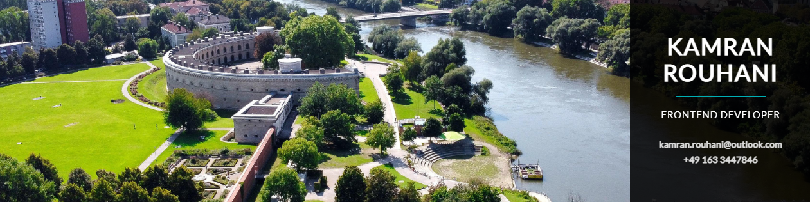

    
    

# Kamran Rouhani (comendrun) - Frontend Web Developer - ReactJS

## ## How Did I Start Learning about Web Development?

I always wanted to work with computers. throughout my childhood, learning Photoshop, Corel Draw, working as a typist, translator, and etc. and also trying to make apps and themes for Symbian OS-based Nokia Mobile phones, I always wanted to make things happen in the digital world. I was far from computers for a couple of years since I went to university and then I wondered, why I didn't even try to pursue what I always wanted to do?
so I decided to start with web development and after a couple of months, I realized that it was the only thing that I want to do. I cant feel the passing of time when I'm in flow state coding. That's something I never experienced before. I even wished my days to be more than 24 hours so maybe I could code a little more. but anyways, I have experienced this feeling and I don't think anything could take this feeling and this joy away from me again.

## A little bit about myself

I'm Kamran. a Frontend Developer with a passion for accessible and modern designs for web applications. 

## What am I doing right now:

- I've just started learning Java Programming language, to be able to use SpringBoot as a backend for a project at work and transitioning from Javascript to Typescript. Let's go!

## How to reach out to me:

- My Personal Website - [comendrun.com](https://comendrun.com/)
- Github - [@comendrun](https://github.com/comendrun)
- Frontend Mentor - [@comendrun](https://www.frontendmentor.io/profile/comendrun)
- Twitter - [@comendrun](https://twitter.com/comendrun)
- Discord - [@comendrun#0492]
- Facebook - [Kamran](https://www.facebook.com/profile.php?id=100075303231964)
- You can [contact me through email](mailto:kamran.rouhani.dev@gmail.com)

# Thanks For Visiting my Github Profile. I Really appreciate your time and attention. have a great day/night ahead 👋

 
    

